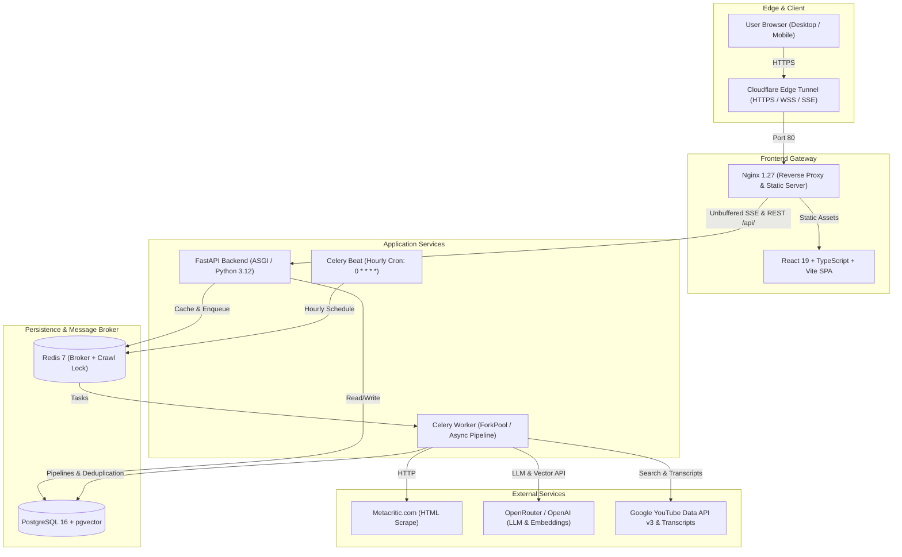

# Metacritic AI Games Monitor — Production Platform (Stage 7)

[]()
[]()
[]()
[]()
[]()
[]()

Production-grade, resilient platform designed to ingest, process, enrich, and analyze video game data from Metacritic. Features automated hourly scheduling, AI-driven Russian sentiment summaries, semantic vector similarity via pgvector, YouTube Let's Play video discovery with transcript AI summaries, and realtime Server-Sent Events monitoring.

---

## Live Public Deployment

- **Production Application URL**: [https://sides-canyon-alloy-harley.trycloudflare.com](https://sides-canyon-alloy-harley.trycloudflare.com)
- **API Liveness**: [https://sides-canyon-alloy-harley.trycloudflare.com/health](https://sides-canyon-alloy-harley.trycloudflare.com/health)
- **API Readiness**: [https://sides-canyon-alloy-harley.trycloudflare.com/ready](https://sides-canyon-alloy-harley.trycloudflare.com/ready)
- **Realtime Monitor Dashboard**: [https://sides-canyon-alloy-harley.trycloudflare.com/monitor](https://sides-canyon-alloy-harley.trycloudflare.com/monitor)
- **Featured Game Detail (Elden Ring)**: [https://sides-canyon-alloy-harley.trycloudflare.com/games/11](https://sides-canyon-alloy-harley.trycloudflare.com/games/11)

---

## Quick Review Walkthrough

For evaluators reviewing this project, here are the primary features and where to inspect them:

### 1. Games Catalog (`/`)
- Dynamic search box filtering by title in realtime.
- Dynamic platform dropdown populated dynamically from `GET /api/platforms`.
- Responsive game card grid displaying Metascores, User Scores, release dates, and platforms.

### 2. Game Detail Page (`/games/:id`, e.g., `/games/11`)
- **Dual AI Review Summaries**: Visually distinct **"Critics say"** and **"Players say"** consensus cards with 3 likes and 3 dislikes generated in Russian.
- **Tabbed Review Explorer**: Browse raw critic and user reviews with author, publication, score, and date.
- **Semantic Similar Games**: pgvector-powered recommendation cards displaying cosine similarity match percentages. Clicking any similar game transitions seamlessly.
- **YouTube Let's Play Card**: High-relevance gameplay video with thumbnail, duration badge, view count, channel name, transcript availability badge, Russian AI summary, and 5 key gameplay takeaways.

### 3. Realtime Monitor Dashboard (`/monitor`)
- **Scheduler State**: Displays Celery Beat hourly status (`0 * * * *` UTC) and next scheduled run countdown.
- **Worker Reachability**: Live ping status for the Celery worker (`celery@<worker_id>`).
- **Active Run Monitor**: Realtime stage pill badge (`discovering` -> `ingesting` -> `reviews` -> `summaries` -> `embedding` -> `youtube` -> `similarity`), animated progress bar, counters, and current game title.
- **Live SSE Timeline**: Realtime Server-Sent Events terminal feed with timestamped event details and reconnection cursor (`Last-Event-ID`).
- **Run Now Trigger**: Dispatches a canonical 20-game crawl run with distributed concurrency lock (HTTP 409) and rate-limiting cooldown (HTTP 429).
- **Durable Run History**: Searchable, paginated audit table of historical runs with expandable event drawers.

---

## Architecture Diagram



---

## Core Engineering Invariants & Guarantees

### 1. Ingestion Pipeline & Deduplication
- **Calendar Day Cycle**: The first run of each calendar day crawls *Games -> New Releases*; subsequent runs throughout the day advance the persistent *Browse -> Newest* pagination cursor (`?page=N`).
- **Strict Deduplication Ledger**: A game is processed at most once per calendar day, enforced by a database constraint `UniqueConstraint("processing_date", "game_external_id")` on `daily_game_processings`.
- **Cursor vs. Ledger Separation**: `DailyCrawlState` serves only as an optimization pointer; `DailyGameProcessing` is the strict deduplication authority.
- **Canonical 20-Game Batch Contract**: Both scheduled runs and manual `Run Now` invocations enforce the canonical batch limit of exactly 20 games (`settings.CRAWL_BATCH_LIMIT = 20`).
- **Distributed Concurrency Lock**: Redis lock (`metacritic:crawl_run:lock`) with 1-hour TTL combined with database state checks (`pending`/`running`). Concurrent triggers return HTTP 409 Conflict with `active_run_id`.
- **Failure Isolation**: Per-game savepoints prevent downstream enrichment failures from rolling back core game records.

### 2. AI Review Summaries & Prompt Hardening
- **Dual Stream Separation**: Critic reviews and user reviews are stored, sampled, and summarized completely independently.
- **Deterministic Sentiment Sampling**: Balances positive, mixed, and negative reviews across multiple platforms without randomness.
- **Prompt Injection Defense**: Review text is treated as untrusted data using explicit delimiter boundaries and system-level instruction guards.
- **SHA-256 Fingerprint Caching**: Canonical review text hashing skips LLM calls when review corpora are unchanged.

### 3. Semantic Embeddings & pgvector Similarity
- **Deterministic Text Representation**: Constructed from title, developer, sorted platforms, description, and AI consensus summaries.
- **Cost-Control Fingerprinting**: Embedding generation is skipped if the input fingerprint matches existing stored embeddings.
- **pgvector Cosine Distance**: Indexed via HNSW (`VECTOR(1536)`) for $O(\log N)$ nearest-neighbor retrieval (`1.0 - (embedding <=> target)`).
- **Self-Exclusion Invariant**: `CheckConstraint("game_id != similar_game_id")` and atomic recommendation replacement.

### 4. YouTube Let's Play Integration
- **Strict Relevance Filtering**: Rejects trailers, OSTs, reviews, reactions, dev diaries, and shorts (`#shorts` or duration `< 180s`).
- **Popularity-Ranked Transcript Fallback**: Iterates top candidate videos by view count. If the top video lacks subtitles, it falls back to rank #2, rank #3, etc.
- **AI Gameplay Summaries**: Generates Russian summary and 5 key gameplay takeaways.
- **Non-Fatal Isolation**: Failures in YouTube search or transcript fetching never fail the core crawler.

### 5. Production Security & Hardening
- **Unbuffered SSE**: Nginx reverse proxy configured with `proxy_buffering off; proxy_cache off; proxy_read_timeout 24h;` for instant event delivery.
- **Rate-Limiting Cooldown**: `MANUAL_RUN_COOLDOWN_SECONDS = 60` returns HTTP 429 Too Many Requests if manual runs are triggered in rapid succession.
- **Information Disclosure Shielding**: Global exception handler masks unhandled 500 errors; debug docs (`/docs`, `/redoc`) are disabled in production.

---

## Tech Stack

- **Backend**: Python 3.12+, FastAPI, SQLAlchemy 2.0 (asyncio + asyncpg), Alembic, Pydantic v2
- **Database**: PostgreSQL 16 (`pgvector/pgvector:pg16`), HNSW vector index
- **Task Queue & Caching**: Redis 7, Celery 5.4+ (Worker + Beat)
- **Frontend**: React 19, TypeScript, Vite, Nginx 1.27
- **AI & Embeddings**: OpenRouter / OpenAI API (`gpt-4o-mini`, `text-embedding-3-small`)
- **Video & Transcripts**: Google YouTube Data API v3, `youtube-transcript-api`
- **Orchestration & Edge**: Docker, Docker Compose, Cloudflare Tunnel
- **Quality & Testing**: pytest, pytest-asyncio, Ruff, mypy

---

## Quickstart with Docker Compose

### 1. Prerequisites
- Docker and Docker Compose installed.
- (Optional) OpenRouter or OpenAI API key, YouTube Data API key.

### 2. Setup Environment
```bash
cp .env.example .env
# Edit .env with your LLM and YouTube credentials
```

### 3. Build and Run
```bash
docker compose up --build -d
```

### 4. Verify Local Services
- **Frontend**: [http://localhost:3000](http://localhost:3000)
- **Backend Health**: [http://localhost:8000/health](http://localhost:8000/health)
- **Backend Readiness**: [http://localhost:8000/ready](http://localhost:8000/ready)
- **Interactive Docs** (Dev mode): [http://localhost:8000/docs](http://localhost:8000/docs)
- **Realtime Monitor**: [http://localhost:3000/monitor](http://localhost:3000/monitor)

### 5. Celery Diagnostic Ping
```bash
docker compose exec celery-worker python -c "from app.workers.tasks import ping; print('Celery Ping Result:', ping())"
```

---

## Developer CLI Tooling

The CLI enables manual triggering of all pipeline components:

```bash
# Run crawler pipeline (canonical limit=20)
docker compose run --rm backend python -m app.cli crawl --limit 20

# Dry-run crawler (parse candidates without persistence)
docker compose run --rm backend python -m app.cli crawl --limit 20 --dry-run

# Enrich specific game with Metacritic reviews and AI summaries
docker compose run --rm backend python -m app.cli enrich --game-id 11

# Generate semantic vector embeddings
docker compose run --rm backend python -m app.cli embed --game-id 11
docker compose run --rm backend python -m app.cli embed --all

# Materialize similar games graph
docker compose run --rm backend python -m app.cli similarity --game-id 11
docker compose run --rm backend python -m app.cli similarity --rebuild-all

# Discover YouTube Let's Play video and transcript summary
docker compose run --rm backend python -m app.cli youtube --game-id 11
docker compose run --rm backend python -m app.cli youtube --missing
```

---

## Automated Quality Gates

To run the complete automated test suite and static analysis locally:

```bash
# Unit & Integration Tests (124 tests, 100% green)
docker compose run --rm backend pytest -v

# Linter (Ruff)
docker compose run --rm backend ruff check .

# Code Formatter Check (Ruff)
docker compose run --rm backend ruff format --check .

# Static Type Analysis (Mypy strict)
docker compose run --rm backend mypy app

# Frontend TypeScript Build
cd frontend && npm run build
```

---

## Database Migrations

Managed through Alembic:

```bash
# Apply all pending migrations to head
docker compose run --rm backend alembic upgrade head

# Rollback one migration
docker compose run --rm backend alembic downgrade -1

# View migration history
docker compose run --rm backend alembic history
```

**Migration Sequence**:
1. `001_initial_schema.py`: Games, platforms, game-platform associations, crawl runs.
2. `002_add_reviews_and_summaries.py`: Reviews, game review summaries.
3. `003_add_pgvector_and_embeddings.py`: pgvector extension, game embeddings table.
4. `004_create_similar_games_table.py`: Similar games cached relationships.
5. `005_crawl_runs_evolution_and_events.py`: Append-only crawl events, rich run metadata.
6. `006_youtube_letsplay.py`: YouTube videos, transcripts, and AI video summaries.

---

## AI Collaboration & Transcripts

All interactions, architectural reasoning, and planning logs throughout development (Stages 1 through 7) are exported and sanitized in the `ai/` directory:
- `ai/conversation.jsonl`: Complete, unified conversation log.
- `ai/stage_1_to_4_transcript.jsonl`: Stages 1–4 transcripts.
- `ai/stage_5_transcript.jsonl`: Stage 5 realtime monitoring & scheduling.
- `ai/stage_6_transcript.jsonl`: Stage 6 YouTube discovery & transcripts.
- `ai/stage_7_transcript.jsonl`: Stage 7 production audit & deployment.
- **Sanitization Guarantee**: Zero API keys or secrets are present in any exported transcripts or git commits.

---

## License

MIT License. Developed for technical assessment evaluation.
