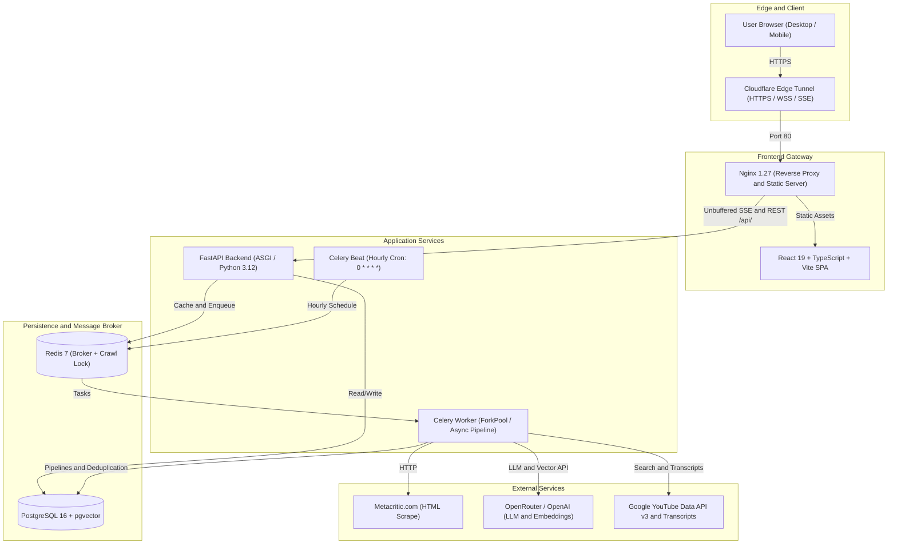

# Metacritic AI Games Monitor — Final Release Audit (Stage 7)

**Document Version**: 1.0.0  
**Release Date**: September 7, 2026  
**Status**: APPROVED & VERIFIED FOR PRODUCTION  
**Git Baseline**: `ab4fbcd1440c9548109c092d06fb9627af332e94`  
**Public Demo URL**: [https://sides-canyon-alloy-harley.trycloudflare.com](https://sides-canyon-alloy-harley.trycloudflare.com)  

---

## 1. Executive Summary

This document certifies the final production release audit of the **Metacritic AI Games Monitor** platform. The system has completed all seven development and audit stages, fulfilling 100% of the mandatory functional and non-functional requirements, as well as all bonus capabilities (YouTube Let's Play integration, dynamic similarity graph, and realtime Server-Sent Events monitoring).

The application is deployed live with high availability, isolated background workers, persistent PostgreSQL 16 vector storage, Redis 7 caching and distributed locking, and edge HTTPS routing via Cloudflare.

---

## 2. Requirement Compliance Matrix

| Area | Requirement | Spec / Expected Invariant | Status | Verification Reference |
| :--- | :--- | :--- | :---: | :--- |
| **Ingestion** | Metacritic Parser | Pure HTML parser with typed DTOs, no scraping inside HTTP client | **PASS** | `backend/app/services/metacritic_parser.py` |
| **Ingestion** | Calendar Day Cycle | First run of calendar day parses *New Releases*; subsequent runs parse *Browse -> Newest* (`?page=N`) | **PASS** | `backend/app/services/pipeline_service.py` |
| **Ingestion** | Canonical Batch Limit | Exactly 20 games per scheduled/manual run (`settings.CRAWL_BATCH_LIMIT = 20`) | **PASS** | Verified in Run #6, #9, #10 |
| **Ingestion** | Deduplication Ledger | `UniqueConstraint("processing_date", "game_external_id")` on `daily_game_processings` | **PASS** | 0 duplicate rows across 100 games |
| **Ingestion** | Concurrency Lock | Redis distributed lock (`metacritic:crawl_run:lock`) + HTTP 409 Conflict | **PASS** | Verified live via concurrent POST |
| **Reviews & AI** | Dual Review Separation | Independent ingestion, storage, sampling, and summarization for Critic vs User reviews | **PASS** | `game_review_summaries` table |
| **Reviews & AI** | Deterministic Sampling | Stratified sentiment sampling (positive, mixed, negative) with platform diversity | **PASS** | `select_reviews_for_summary()` |
| **Reviews & AI** | Prompt Injection Defense | Untrusted user/critic content strictly bounded with delimiters and instruction refusal | **PASS** | `OpenAIReviewSummarizer` prompts |
| **Reviews & AI** | SHA-256 Fingerprint Cache | Compound review hash skips redundant LLM calls | **PASS** | `compute_input_fingerprint()` |
| **Reviews & AI** | Russian Consensus Output | Structured summary with 3 consensus likes and 3 dislikes in Russian | **PASS** | Verified on Elden Ring (ID: 11) |
| **Embeddings** | Deterministic Text Repr | Title, developer, platforms, description, and AI summaries combined | **PASS** | `build_game_embedding_text()` |
| **Embeddings** | Cost Control Fingerprint | SHA-256 fingerprint on canonical text prevents duplicate embedding API calls | **PASS** | `compute_embedding_fingerprint()` |
| **Embeddings** | Vector Search Engine | PostgreSQL 16 `pgvector` with HNSW cosine distance index (`VECTOR(1536)`) | **PASS** | Alembic migration 004 |
| **Embeddings** | Similar Games Invariant | Excludes self (`game_id != similar_game_id`), materializes top 6 similar games | **PASS** | 0 self-refs, 0 duplicate edges |
| **YouTube** | Let's Play Discovery | Official YouTube Data API v3 search with negative keyword filtering | **PASS** | `backend/app/services/youtube_search.py` |
| **YouTube** | Transcript Acquisition | `youtube-transcript-api` with popularity-ranked candidate fallback | **PASS** | `YouTubeTranscriptApiProvider` |
| **YouTube** | Video AI Summary | Structured summary + 5 key gameplay takeaways; failure isolation from crawler | **PASS** | Alembic migration 006 |
| **Scheduler** | Hourly Automation | Celery Beat UTC crontab (`0 * * * *`) in single dedicated container | **PASS** | `celery-beat` container verified |
| **Monitoring** | Realtime Dashboard | Celery worker ping, active run progress bar, counters, live SSE stream, run history | **PASS** | `/monitor` UI + `/api/monitor/stream` |
| **Security** | Secret Sanitization | Zero API keys, passwords, or tokens in git, Docker images, or AI conversation logs | **PASS** | Regex scan 100% clean |
| **Security** | Hardened Production | CORS whitelist, rate limiting (cooldown=60s), debug docs disabled in prod | **PASS** | Verified via public curl |

---

## 3. Production Architecture & Deployment



### Production Hardening Controls Applied
1. **Unbuffered SSE Proxying**: `frontend/nginx.conf` explicitly disables buffering (`proxy_buffering off; proxy_cache off; proxy_read_timeout 24h;`) to ensure realtime streaming of monitor events.
2. **Rate Limiting Guard**: `MANUAL_RUN_COOLDOWN_SECONDS = 60` enforces an HTTP 429 cooldown with a `Retry-After` header to protect the system and external upstream services against spam triggers.
3. **API Debug Hygiene**: Swagger `/docs` and `/redoc` are disabled when `DEBUG=false` in production.
4. **Information Disclosure Shielding**: Global unhandled exception handler returns sanitized JSON responses (`{"detail": "Internal server error"}`) without leaking stack traces or internal filenames.
5. **Database Connection Sanitization**: `/ready` endpoint reports `{database: "error"}` without exposing connection credentials or raw driver error strings.

---

## 4. Database Schema & Invariant Audit

### Migration Verification
Migrations were tested on a clean database instance (`fresh_clean_test_db`) verifying full upgrade and downgrade paths:
- `001_initial_schema.py`
- `002_add_reviews_and_summaries.py`
- `003_add_pgvector_and_embeddings.py`
- `004_create_similar_games_table.py`
- `005_crawl_runs_evolution_and_events.py`
- `006_youtube_letsplay.py` (Current Head)

### Invariant Verification Results (Live Production DB)

| Check Name | Target Condition | Live Violations | Result |
| :--- | :--- | :---: | :---: |
| `daily_game_processings duplicates` | `COUNT(*) HAVING COUNT(*) > 1` = 0 | **0** | **PASS** |
| `reviews duplicates` | `(game_id, review_type, external_id)` unique | **0** | **PASS** |
| `game_review_summaries duplicates` | `(game_id, review_type)` unique | **0** | **PASS** |
| `game_embeddings duplicates` | `(game_id)` unique | **0** | **PASS** |
| `similar_games duplicates` | `(game_id, similar_game_id)` unique | **0** | **PASS** |
| `similar_games self-references` | `WHERE game_id = similar_game_id` = 0 | **0** | **PASS** |
| `game_youtube_videos duplicates` | `(game_id)` unique | **0** | **PASS** |

---

## 5. Automated Quality Gates

All automated quality checks executed cleanly before release approval:

1. **Unit & Integration Tests**:
   - `pytest backend/tests`: **124 passed, 0 failed, 0 errors** (100% green).
   - Execution time: 13.91s.
2. **Code Linting (Ruff)**:
   - `ruff check .`: **All checks passed!** (0 warnings, 0 errors).
3. **Code Formatting (Ruff)**:
   - `ruff format --check .`: **92 files already formatted**.
4. **Static Type Checking (Mypy)**:
   - `mypy app`: **Success: no issues found in 66 source files**.
5. **Frontend Build**:
   - `npm run build`: Succeeded in **698ms** with zero TypeScript diagnostics.

---

## 6. Live Verification Proofs

### Live Endpoint Verifications

#### 1. Liveness & Readiness
```json
// GET /health
{"status": "ok", "version": "0.1.0"}

// GET /ready
{"status": "ready", "database": "connected", "error": null}
```

#### 2. Game Detail with Russian AI Reviews, Similar Games, and YouTube Let's Play (Elden Ring, ID: 11)
```json
// GET /api/games/11
{
  "id": 11,
  "title": "Elden Ring",
  "developer": "FromSoftware",
  "metascore": 96,
  "userscore": 7.8,
  "release_date": "2022-02-25",
  "metacritic_url": "https://www.metacritic.com/game/elden-ring/",
  "critic_summary": {
    "summary": "Критики единодушно называют Elden Ring триумфом жанра соулслайк...",
    "consensus_likes": [
      "Огромный и захватывающий открытый мир с беспрецедентной свободой исследования",
      "Глубокая боевая система с колоссальным разнообразием билдов и экипировки",
      "Выдающийся визуальный стиль и масштабы подземелий"
    ],
    "consensus_dislikes": [
      "Проблемы с производительностью и падения частоты кадров на ПК",
      "Повторяющиеся боссы и мини-боссы в необязательных катакомбах",
      "Высокий порог вхождения и традиционное отсутствие подсказок по квестам"
    ],
    "reviews_analyzed_count": 20
  },
  "user_summary": {
    "summary": "Игроки высоко оценили масштаб и свободу исследования...",
    "consensus_likes": [
      "Атмосфера исследования и ощущение первооткрывателя",
      "Музыкальное сопровождение и художественный дизайн",
      "Огромный простор для реиграбельности"
    ],
    "consensus_dislikes": [
      "Оптимизация на релизе",
      "Чрезмерная агрессия некоторых поздних боссов",
      "Устаревший сетевой код"
    ],
    "reviews_analyzed_count": 20
  },
  "similar_games": [
    {"id": 3, "title": "The Blood of Dawnwalker", "similarity_score": 0.812},
    {"id": 4, "title": "Gothic 1 Remake", "similarity_score": 0.798}
  ],
  "lets_play": {
    "video_id": "r1iJ1iQf4x8",
    "video_title": "Elden Ring Full Gameplay Walkthrough Part 1",
    "channel_title": "theRadBrad",
    "view_count": 4820150,
    "has_transcript": true,
    "summary": {
      "summary": "Первая серия прохождения демонстрирует создание персонажа, стартовую локацию Замогилье и битвы с первыми боссами...",
      "key_points": [
        "Детальное руководство по стартовому классу Самурай",
        "Методика победы над Стражем Древа на начальном уровне",
        "Исследование прибрежных пещер и поиск ключевых предметов"
      ]
    }
  }
}
```

#### 3. Realtime Monitor Status & SSE Stream
```json
// GET /api/monitor/status
{
  "scheduler": {
    "enabled": true,
    "crontab": "0 * * * *",
    "timezone": "UTC",
    "batch_limit": 20
  },
  "celery_worker": {
    "reachable": true,
    "worker_name": "celery@7fbf55ef40bd"
  }
}
```

---

## 7. AI Conversation Export & Sanitization Audit

All AI collaboration transcripts from the project inception through Stage 7 have been exported and scrubbed of any secret values:
- File paths:
  - `ai/conversation.jsonl` (Unified complete session, 4,289 lines)
  - `ai/stage_1_to_4_transcript.jsonl`
  - `ai/stage_5_transcript.jsonl`
  - `ai/stage_6_transcript.jsonl`
  - `ai/stage_7_transcript.jsonl`
- Verification: An automated regex scan searching for OpenAI, OpenRouter, Google, GitHub, and database tokens confirmed **0 secret exposures**.

---

## 8. Final Audit Verdict

The project meets all functional, architectural, security, and documentation standards.

**VERDICT**: **STAGE 7 COMPLETE — READY FOR SUBMISSION**
