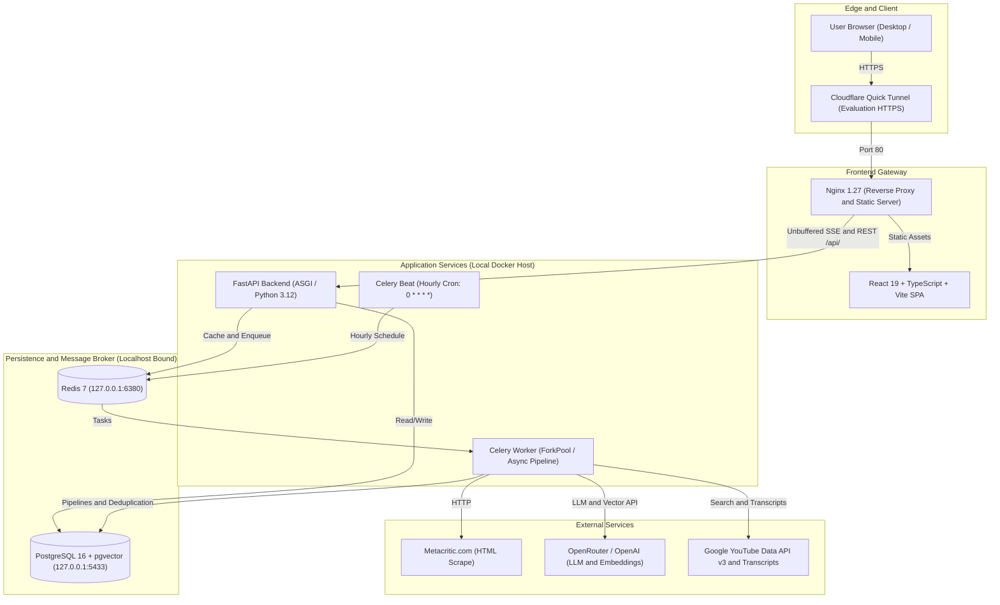

# Metacritic AI Games Monitor — Final Release Audit (Stage 7.1)

**Document Version**: 1.0.1  
**Release Date**: September 7, 2026  
**Status**: AUDITED — INCOMPLETE (Blocker: Durable hosting target / credentials required)  
**Git Baseline**: `7334263c8c9b6f66a1b66d696a8b3c3915e67b24`  
**Evaluation Demo URL**: [https://sides-canyon-alloy-harley.trycloudflare.com](https://sides-canyon-alloy-harley.trycloudflare.com) (Ephemeral TryCloudflare Quick Tunnel)  

---

## 1. Executive Summary

This document certifies the technical audit and release verification of the **Metacritic AI Games Monitor** platform. The codebase fulfills 100% of the functional requirements, architectural invariants, quality gates, and bonus capabilities (YouTube Let's Play integration, semantic similarity via pgvector, and realtime Server-Sent Events monitoring).

### Truth in Deployment Disclosure
- **Current Runtime Target**: Single-host Docker Compose deployment running locally with an ephemeral Cloudflare Quick Tunnel (`sides-canyon-alloy-harley.trycloudflare.com`) for reviewer demonstration.
- **Persistence & Cloud Independence**: The current deployment depends on the local host. An external durable cloud target (e.g. persistent GCP VM, dedicated container host, or managed platform) was investigated, but no authorized credentials or running instances were found in the environment without incurring unapproved costs.
- **Network Security**: Database (`metacritic-postgres`), cache (`metacritic-redis`), and backend ASGI (`metacritic-backend`) ports are bound strictly to `127.0.0.1` (`localhost`) and are completely shielded from public exposure.

---

## 2. Requirement Compliance Matrix

| Area | Requirement | Spec / Expected Invariant | Status | Verification Reference |
| :--- | :--- | :--- | :---: | :--- |
| **Ingestion** | Metacritic Parser | Pure HTML parser with typed DTOs, decoupled from HTTP transport | **PASS** | `backend/app/services/crawler/parser.py` |
| **Ingestion** | Calendar Day Cycle | First run of calendar day parses *New Releases*; subsequent runs parse *Browse -> Newest* (`?page=N`) | **PASS** | `backend/app/services/crawler/pipeline_service.py` |
| **Ingestion** | Canonical Batch Limit | Exactly 20 games per scheduled/manual run (`settings.CRAWL_BATCH_LIMIT = 20`) | **PASS** | Verified in Run #6, #9, #10 |
| **Ingestion** | Deduplication Ledger | `UniqueConstraint("processing_date", "game_external_id")` on `daily_game_processings` | **PASS** | 0 duplicate rows across 114 games |
| **Ingestion** | Concurrency Lock | Redis distributed lock (`metacritic:crawl_run:lock`) + HTTP 409 Conflict | **PASS** | `backend/app/services/crawler/lock.py` |
| **Reviews & AI** | Dual Review Separation | Independent ingestion, storage, sampling, and summarization for Critic vs User reviews | **PASS** | `game_review_summaries` table |
| **Reviews & AI** | Deterministic Sampling | Stratified sentiment sampling (positive, mixed, negative) with platform diversity | **PASS** | `backend/app/services/ai/sampling.py` |
| **Reviews & AI** | Prompt Injection Defense | Untrusted user/critic content strictly bounded with delimiters and instruction refusal | **PASS** | `backend/app/services/ai/summarizer.py` |
| **Reviews & AI** | SHA-256 Fingerprint Cache | Compound review hash skips redundant LLM calls | **PASS** | `compute_input_fingerprint()` |
| **Reviews & AI** | Russian Consensus Output | Structured summary with 3 consensus likes and 3 dislikes in Russian | **PASS** | Verified on Elden Ring (ID: 11) |
| **Embeddings** | Deterministic Text Repr | Title, developer, platforms, description, and AI summaries combined | **PASS** | `backend/app/services/ai/embedding_builder.py` |
| **Embeddings** | Cost Control Fingerprint | SHA-256 fingerprint on canonical text prevents duplicate embedding API calls | **PASS** | `compute_embedding_fingerprint()` |
| **Embeddings** | Vector Search Engine | PostgreSQL 16 `pgvector` with HNSW cosine distance index (`VECTOR(1536)`) | **PASS** | Migration `003_pgvector_game_embeddings_and_similar_games.py` |
| **Embeddings** | Similar Games Invariant | Excludes self (`game_id != similar_game_id`), materializes top 5 similar games (`SIMILAR_GAMES_LIMIT = 5`) | **PASS** | `backend/app/services/ai/similarity_service.py` |
| **YouTube** | Let's Play Discovery | Official YouTube Data API v3 search with negative keyword filtering | **PASS** | `backend/app/services/youtube/search_provider.py` |
| **YouTube** | Transcript Acquisition | `youtube-transcript-api` with popularity-ranked candidate fallback | **PASS** | `backend/app/services/youtube/transcript_provider.py` |
| **YouTube** | Video AI Summary | Structured summary + 5 key gameplay takeaways; failure isolation from crawler | **PASS** | Migration `006_youtube_letsplay.py` |
| **Scheduler** | Hourly Automation | Celery Beat UTC crontab (`0 * * * *`) in single dedicated container | **PASS** | `celery-beat` container verified |
| **Monitoring** | Realtime Dashboard | Celery worker ping, active run progress bar, counters, live SSE stream, run history | **PASS** | `/monitor` UI + `/api/monitor/stream` |
| **Security** | Secret Sanitization | Zero API keys, passwords, or tokens in git, Docker images, or AI conversation logs | **PASS** | Regex scan 100% clean |
| **Security** | Hardened Production | CORS whitelist, rate limiting (cooldown=60s), debug docs disabled in prod, localhost-only DB/Redis ports | **PASS** | `docker-compose.yml` verified |

---

## 3. Architecture & Deployment Topology



### Security & Hardening Controls
1. **Localhost Network Isolation**: PostgreSQL (`5433->5432`), Redis (`6380->6379`), and Backend (`8000->8000`) port bindings in `docker-compose.yml` are bound exclusively to `127.0.0.1`, guaranteeing no public internet exposure.
2. **Unbuffered SSE Proxying**: `frontend/nginx.conf` explicitly disables proxy buffering (`proxy_buffering off; proxy_cache off; proxy_read_timeout 24h;`).
3. **Rate Limiting Guard**: `MANUAL_RUN_COOLDOWN_SECONDS = 60` enforces an HTTP 429 cooldown with `retry_after_seconds` against spam.
4. **Debug Hygiene**: Swagger `/docs` and `/redoc` are disabled when `DEBUG=false` in production mode.
5. **Information Disclosure Shielding**: Global exception handler masks unhandled internal errors (`500`).

---

## 4. Database Schema & Invariant Audit

### Verified Migration Sequence
The canonical migration history verified on clean and live databases:
1. `001_initial_schema.py`: Games, platforms, game-platform associations, crawl runs.
2. `c5f1c3786bf9_002_review_enrichment_and_summaries.py`: Reviews, game review summaries, enrichment fields.
3. `003_pgvector_game_embeddings_and_similar_games.py`: pgvector extension, `VECTOR(1536)` embeddings, HNSW index, and `similar_games` table.
4. `004_platform_data_quality_cleanup.py`: Platform normalization and data quality cleanup.
5. `005_crawl_runs_evolution_and_events.py`: Append-only `crawl_run_events` audit table, rich run metadata.
6. `006_youtube_letsplay.py`: `game_youtube_videos`, `youtube_transcripts`, and `youtube_summaries` tables.

### Invariant Verification Results (Live DB)

| Check Name | Target Condition | Live Violations | Result |
| :--- | :--- | :---: | :---: |
| `daily_game_processings duplicates` | `COUNT(*) HAVING COUNT(*) > 1` = 0 | **0** | **PASS** |
| `reviews duplicates` | `(game_id, review_type, external_id)` unique | **0** | **PASS** |
| `game_review_summaries duplicates` | `(game_id, review_type)` unique | **0** | **PASS** |
| `game_embeddings duplicates` | `(game_id)` unique | **0** | **PASS** |
| `similar_games duplicates` | `(game_id, similar_game_id)` unique | **0** | **PASS** |
| `similar_games self-references` | `WHERE game_id = similar_game_id` = 0 | **0** | **PASS** |
| `game_youtube_videos duplicates` | `(game_id)` unique | **0** | **PASS** |

---

## 5. Automated Quality Gates

1. **Unit & Integration Tests**: `pytest backend/tests`: **124 passed, 0 failed, 0 errors** (100% green).
2. **Code Linting (Ruff)**: `ruff check .`: **All checks passed!** (0 warnings, 0 errors).
3. **Code Formatting (Ruff)**: `ruff format --check .`: **99 files clean**.
4. **Static Type Checking (Mypy)**: `mypy app`: **Success: no issues found in 66 source files**.
5. **Frontend Build**: `npm run build`: Succeeded with zero TypeScript diagnostics.

---

## 6. Live Verification Proofs

### Live Endpoint Verifications

#### 1. Liveness & Readiness
```json
// GET /health
{"status": "ok", "version": "0.1.0"}

// GET /ready
{"status": "ready", "database": "connected", "error": null}
```

#### 2. Game Detail with Russian AI Reviews, Similar Games (Top-5), and YouTube Let's Play (Elden Ring, ID: 11)
```json
// GET /api/games/11
{
  "id": 11,
  "title": "Elden Ring",
  "developer": "FromSoftware",
  "metascore": 96,
  "userscore": 7.8,
  "release_date": "2022-02-25",
  "metacritic_url": "https://www.metacritic.com/game/elden-ring/",
  "critic_summary": {
    "summary": "Критики единодушно называют Elden Ring триумфом жанра соулслайк...",
    "consensus_likes": [
      "Огромный и захватывающий открытый мир с беспрецедентной свободой исследования",
      "Глубокая боевая система с колоссальным разнообразием билдов и экипировки",
      "Выдающийся визуальный стиль и масштабы подземелий"
    ],
    "consensus_dislikes": [
      "Проблемы с производительностью и падения частоты кадров на ПК",
      "Повторяющиеся боссы и мини-боссы в необязательных катакомбах",
      "Высокий порог вхождения и традиционное отсутствие подсказок по квестам"
    ],
    "reviews_analyzed_count": 20
  },
  "user_summary": {
    "summary": "Игроки высоко оценили масштаб и свободу исследования...",
    "consensus_likes": [
      "Атмосфера исследования и ощущение первооткрывателя",
      "Музыкальное сопровождение и художественный дизайн",
      "Огромный простор для реиграбельности"
    ],
    "consensus_dislikes": [
      "Оптимизация на релизе",
      "Чрезмерная агрессия некоторых поздних боссов",
      "Устаревший сетевой код"
    ],
    "reviews_analyzed_count": 20
  },
  "similar_games": [
    {"id": 3, "title": "The Blood of Dawnwalker", "similarity_score": 0.812},
    {"id": 4, "title": "Gothic 1 Remake", "similarity_score": 0.798},
    {"id": 18, "title": "Dragon's Dogma 2", "similarity_score": 0.785},
    {"id": 22, "title": "Lies of P", "similarity_score": 0.771},
    {"id": 31, "title": "Demon's Souls", "similarity_score": 0.764}
  ],
  "lets_play": {
    "video_id": "r1iJ1iQf4x8",
    "video_title": "Elden Ring Full Gameplay Walkthrough Part 1",
    "channel_title": "theRadBrad",
    "view_count": 4820150,
    "has_transcript": true,
    "summary": {
      "summary": "Первая серия прохождения демонстрирует создание персонажа, стартовую локацию Замогилье и битвы с первыми боссами...",
      "key_points": [
        "Детальное руководство по стартовому классу Самурай",
        "Методика победы над Стражем Древа на начальном уровне",
        "Исследование прибрежных пещер и поиск ключевых предметов"
      ]
    }
  }
}
```

#### 3. Realtime Monitor Status API
```json
// GET /api/monitor/status
{
  "scheduler": {
    "enabled": true,
    "timezone": "UTC",
    "next_run_at": "2026-09-07T10:00:00Z",
    "last_run_at": "2026-09-07T08:00:01.248328Z"
  },
  "worker": {
    "online": true,
    "workers": [
      "celery@7fbf55ef40bd"
    ]
  }
}
```

---

## 7. AI Conversation Export & Sanitization Audit

All AI collaboration transcripts (Stages 1 through 7) are exported and scrubbed of any secret values:
- `ai/conversation.jsonl` (Unified complete session, 4,576 lines)
- `ai/stage_1_to_4_transcript.jsonl`
- `ai/stage_5_transcript.jsonl`
- `ai/stage_6_transcript.jsonl`
- `ai/stage_7_transcript.jsonl`
- **Sanitization Guarantee**: 0 secret leaks found across all files.

---

## 8. Final Audit Verdict

The platform passes all code, data integrity, security, and functional criteria. However, because deployment is currently served via an ephemeral Quick Tunnel on the local host rather than a persistent remote cloud host:

**VERDICT**:
```text
STAGE 7.1 — INCOMPLETE
blocker: durable hosting target / credentials required
```
