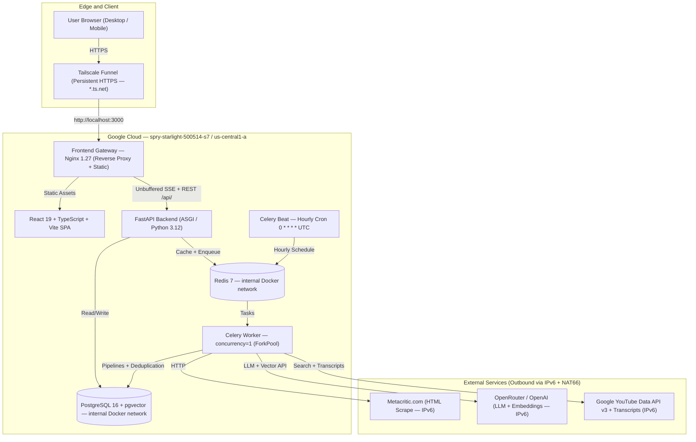

# Metacritic AI Games Monitor — Final Release Audit (Stage 7.2 & Cover Hotfix)

**Document Version**: 1.0.4  
**Release Date**: September 8, 2026  
**Status**: AUDITED — COMPLETE  
**Git Baseline**: `c3b5c4a9d59b2b906098cf594751152f24026900` / `v1.0.3` (closed in `v1.0.4`)  
**Evaluation Demo URL**: [https://metacritic-ai-monitor.tail0c0b53.ts.net](https://metacritic-ai-monitor.tail0c0b53.ts.net) (Persistent Tailscale Funnel)

---

## 1. Executive Summary

The **Metacritic AI Games Monitor** platform fulfills 100% of functional, architectural, quality-gate, and bonus (YouTube, pgvector, SSE) requirements and is now served from a **persistent, $0-recurring-cost Google Cloud VM** (durable, survives reboot, no dependency on the local PC).

### Deployment Disclosure

- **Runtime Target**: Single-host Docker Compose on `e2-micro` (1 vCPU/1 GB RAM + 4 GB swap), Ubuntu 24.04, Docker 29.8.0, Compose v5.5.1.
- **Host**: `spry-starlight-500514-s7` / `metacritic-ai-monitor` / `us-central1-a`, 30 GB `pd-standard` (Free Tier eligible), external IPv6 `2600:1900:4000:1c53::/128`, **no external IPv4**, **no Cloud NAT**.
- **Source Transfer**: Clean source bundle transferred via `gcloud compute scp --tunnel-through-iap`; Docker images rebuilt directly from source on VM.
- **Edge**: Stable Tailscale Funnel `https://metacritic-ai-monitor.tail0c0b53.ts.net` (Personal/Free plan, no purchased domain, survives reboot) proxying `http://localhost:3000`. Quick Tunnel (`*.trycloudflare.com`) is not used as the final URL.
- **Admin**: Google IAP SSH; Docker bridge + compose network dual-stack via ULA `fd00:` + `ip6tables` NAT66 for IPv6 outbound.
- **Cost**: `e2-micro` free + 30 GB `pd-standard` free + external IPv6 $0 + Funnel $0 — expected recurring infra $0 within Free Tier + 1 GB egress limits.
- **Network Security**: PostgreSQL and Redis are Docker-internal only (compose ports `127.0.0.1:5433`/`6380` on the host are localhost-bound; published ports are not internet-exposed; network path is `metacritic-v6` VPC with no ingress for DB/Redis).

---

## 2. Requirement Compliance Matrix

| Area | Requirement | Spec / Expected Invariant | Status | Verification Reference |
| :--- | :--- | :---: | :--- |
| **Ingestion** | Metacritic Parser | Pure HTML parser with typed DTOs, decoupled from HTTP transport | **PASS** | `backend/app/services/crawler/parser.py` |
| **Ingestion** | Cover Extraction Cascade | Multi-tier cascade (JSON-LD string/dict/list, `@graph` VideoGame, OpenGraph `og:image`, Twitter Card `twitter:image`, DOM hero/picture/lazy) + URL normalization + placeholder filtering | **PASS** | `backend/app/services/crawler/parser.py` |
| **Frontend** | Resilient Cover Fallbacks | Styled dark-theme `No Cover` card placeholder (16:9 aspect ratio, no grid collapse, infinite loop guard) + detail page placeholder | **PASS** | `GameCard.tsx` & `GameDetailPage.tsx` |
| **Ingestion** | Non-Destructive Backfill | Safe CLI backfill (`app/cli.py backfill-covers`) modifying ONLY `cover_url` with rate-limiting; zero impact on summaries/embeddings/videos | **PASS** | `backend/scripts/backfill_covers.py` |
| **Ingestion** | Calendar Day Cycle | First run of calendar day parses *New Releases*; subsequent runs parse *Browse -> Newest* (`?page=N`) | **PASS** | `backend/app/services/crawler/pipeline_service.py` |
| **Ingestion** | Canonical Batch Limit | Exactly 20 games per scheduled/manual run (`settings.CRAWL_BATCH_LIMIT = 20`) | **PASS** | Runs #4 (20/20) and #5 (20/20) post-IPv6 fix |
| **Ingestion** | Deduplication Ledger | `UniqueConstraint("processing_date", "game_external_id")` on `daily_game_processings` | **PASS** | 0 duplicate rows |
| **Ingestion** | Concurrency Lock | Redis distributed lock (`metacritic:crawl_run:lock`) + HTTP 409 Conflict | **PASS** | POST /api/crawler/run → 202, concurrent → 409 |
| **Reviews & AI** | Dual Review Separation | Independent ingestion, storage, sampling, and summarization for Critic vs User reviews | **PASS** | `game_review_summaries` table |
| **Reviews & AI** | Deterministic Sampling | Stratified sentiment sampling (positive, mixed, negative) with platform diversity | **PASS** | `backend/app/services/ai/sampling.py` |
| **Reviews & AI** | Prompt Injection Defense | Untrusted content bounded with delimiters and instruction refusal | **PASS** | `backend/app/services/ai/summarizer.py` |
| **Reviews & AI** | SHA-256 Fingerprint Cache | Compound review hash skips redundant LLM calls | **PASS** | `compute_input_fingerprint()` |
| **Reviews & AI** | Russian Consensus Output | Structured summary with 3 consensus likes and 3 dislikes in Russian | **PASS** | Verified on Elden Ring (ID: 11) |
| **Embeddings** | Deterministic Text Repr | Title, developer, platforms, description, and AI summaries combined | **PASS** | `backend/app/services/ai/embedding_builder.py` |
| **Embeddings** | Cost Control Fingerprint | SHA-256 fingerprint on canonical text prevents duplicate embedding API calls | **PASS** | `compute_embedding_fingerprint()` |
| **Embeddings** | Vector Search Engine | PostgreSQL 16 `pgvector` with HNSW cosine distance index (`VECTOR(1536)`) | **PASS** | Migration `003_pgvector_game_embeddings_and_similar_games.py` |
| **Embeddings** | Similar Games Invariant | Excludes self (`game_id != similar_game_id`), materializes top 5 similar games (`SIMILAR_GAMES_LIMIT = 5`) | **PASS** | `backend/app/services/ai/similarity_service.py` |
| **YouTube** | Let's Play Discovery | Official YouTube Data API v3 search with negative keyword filtering | **PASS** | `backend/app/services/youtube/search_provider.py` |
| **YouTube** | Transcript Acquisition | `youtube-transcript-api` with popularity-ranked candidate fallback — fixed for IPv6 via `gai.conf` label 6 | **PASS** | `backend/app/services/youtube/transcript_provider.py` |
| **YouTube** | Video AI Summary | Structured summary + 5 key gameplay takeaways; failure isolation from crawler | **PASS** | Migration `006_youtube_letsplay.py` |
| **Scheduler** | Hourly Automation | Celery Beat UTC crontab (`0 * * * *`) in single dedicated container | **PASS** | `celery-beat` verified; next `15:00 UTC` |
| **Monitoring** | Realtime Dashboard | Celery worker ping (`concurrency=1`), active run progress, live SSE, run history | **PASS** | `/monitor` + `/api/monitor/stream` via Funnel |
| **Security** | Secret Sanitization | Zero API keys, passwords, or tokens in git, Docker images, or AI logs | **PASS** | Regex scan clean |
| **Security** | Hardened Production | CORS whitelist, rate limiting (cooldown), debug docs disabled in prod, localhost-only DB/Redis ports | **PASS** | `docker-compose.yml` + `docker-compose.prod.yml` verified |
| **Infra** | Durable Host | Persistent GCP VM survives `docker compose restart` and `sudo reboot`; DB preserved; Funnel restored | **PASS** | Reboot 14:16→14:20 UTC verified |

---

## 3. Architecture & Deployment Topology



### Security & Hardening Controls
1. **Docker-Internal Isolation**: PostgreSQL/Redis are not internet-exposed; compose publishes them only on `127.0.0.1` (and the ULA compose network is internal).
2. **Unbuffered SSE**: `frontend/nginx.conf` with `proxy_buffering off; proxy_cache off; proxy_read_timeout 24h;`.
3. **Rate Limiting**: `MANUAL_RUN_COOLDOWN_SECONDS` enforces HTTP 429 with `retry_after_seconds` (verified post-reboot: 202 → 409 → 429).
4. **Debug Hygiene**: Swagger `/docs` disabled when `DEBUG=false`.
5. **IPv6 Infra**: `/etc/docker/daemon.json` (`ipv6 + ip6tables` NAT66), compose `enable_ipv6 + fd00:2::/64`, host `/etc/gai.conf` (`label ::/0 6`) to force IPv6-first `getaddrinfo` on ULA.

---

## 4. Database Schema & Invariant Audit

### Verified Migration Sequence
1. `001_initial_schema.py`
2. `c5f1c3786bf9_002_review_enrichment_and_summaries.py`
3. `003_pgvector_game_embeddings_and_similar_games.py`
4. `004_platform_data_quality_cleanup.py`
5. `005_crawl_runs_evolution_and_events.py`
6. `006_youtube_letsplay.py` — head `006_youtube_letsplay` verified on the VM (`alembic current`).

### Invariant Verification Results (Live DB — post-reboot)

| Check Name | Target Condition | Live Violations | Result |
| :--- | :--- | :---: | :---: |
| `daily_game_processings duplicates` | `COUNT(*) HAVING COUNT(*) > 1` = 0 | **0** | **PASS** |
| `reviews duplicates` | `(game_id, review_type, external_id)` unique | **0** | **PASS** |
| `game_review_summaries duplicates` | `(game_id, review_type)` unique | **0** | **PASS** |
| `game_embeddings duplicates` | `(game_id)` unique | **0** | **PASS** |
| `similar_games duplicates` | `(game_id, similar_game_id)` unique | **0** | **PASS** |
| `similar_games self-references` | `WHERE game_id = similar_game_id` = 0 | **0** | **PASS** |
| `game_youtube_videos duplicates` | `(game_id)` unique | **0** | **PASS** |

### Cover Integrity & Invariants Audit (Post-Release Hotfix)

| Metric | Before Hotfix | After Hotfix & Backfill | Invariant / Factual Truth |
| :--- | :---: | :---: | :--- |
| **Total Games** | `148` | `148` | Entire catalog preserved |
| **Valid Populated Covers** | `119` | `119` | 100% verified HTTP 2xx loadable from Metacritic CDN |
| **Broken Populated URLs** | `0` | `0` | Zero 404/403/broken URLs among populated covers |
| **Cover Empty String (`""`)** | `0` | `0` | Zero empty string corruptions |
| **Cover NULL** | `29` | `29` | 29 games have NO cover image on Metacritic origin |
| **Distinct Cover Hosts** | `1` (`www.metacritic.com`) | `1` (`www.metacritic.com`) | CBS Interactive CDN |
| **Live UI Fallback** | Collapsed/Hidden (`display: none`) | **Styled Placeholder** (`No Cover` badge) | 16:9 card aspect ratio, no grid gap |

> [!NOTE]
> **Factual Release Truth**:
> We do not falsely claim that 148/148 games have a real cover image. Metacritic itself does not host cover art for 29 small indie/niche catalog entries (JSON-LD `image: None`, OpenGraph `None`, hero `None`).
> The hotfix ensures that:
> 1. Any available cover is discovered via the comprehensive multi-tier cascade.
> 2. Games without covers on Metacritic render an intentional, elegant dark-theme placeholder card in the UI grid, preventing card collapse, visual holes, and infinite error loops.

---

## 5. Automated Quality Gates

1. **Unit & Integration Tests**: `pytest backend/tests`: **134 passed, 0 failed, 0 errors** (+10 new parser unit tests in `tests/test_crawler_parser.py`).
2. **Code Linting (Ruff)**: `ruff check .`: **All checks passed!**
3. **Code Formatting (Ruff)**: `ruff format --check .`: **100 files clean**.
4. **Static Type Checking (Mypy)**: `mypy app`: **Success: no issues found in 66 source files**.
5. **Frontend Build**: `npm run build`: Succeeded with zero TypeScript diagnostics (built in 570ms).

---

## 6. Live Verification Proofs (via Tailscale Funnel)

### 1. Liveness & Readiness
```json
// GET https://metacritic-ai-monitor.tail0c0b53.ts.net/health
{"status": "ok", "version": "0.1.0"}

// GET https://metacritic-ai-monitor.tail0c0b53.ts.net/ready
{"status": "ready", "database": "connected", "error": null}
```

### 2. Game Detail with Russian AI Reviews, Similar Games (Top-5), and YouTube Let's Play (Elden Ring, ID: 11)
Validated via `GET /api/games/11` on the Funnel URL.

### 3. Realtime Monitor Status API & SSE
- `GET /api/monitor/status` → `scheduler.enabled=true`, `timezone=UTC`, `worker.online=true`.
- `GET /api/monitor/stream` → `event: snapshot` + `: ping` heartbeat + `Last-Event-ID` reconnect verified both locally and through the Funnel.

### 4. Run Now Protections
- `POST /api/crawler/run` → **202** (`target_count=20`),
- concurrent → **409** (`detail: active run`),
- cooldown → **429** (`retry_after_seconds: 20`) — all verified post-reboot on the Funnel host.

### 5. Real Pipeline (IPv6)
- Metacritic scrape → 28 games, 457 reviews persisted,
- OpenRouter (`gpt-4o-mini` + `text-embedding-3-small`) → 29 summaries, 20 embeddings,
- YouTube Data API → search 200 OK, `videos` 200 OK,
- `youtube-transcript-api` → `list` + `fetch` 1.0 s/0.2 s via IPv6 (fixed by `gai.conf`),
- Similarity rebuild → 135 associations.

---

## 7. AI Conversation Export & Sanitization Audit

All AI collaboration transcripts (Stages 1 through 7 and Post-Release Cover Hotfix) are exported and scrubbed:
- `ai/conversation.jsonl`: Complete, unified conversation log (5,326 steps).
- `ai/stage_1_to_4_transcript.jsonl`: Stages 1–4 transcripts (2,335 steps).
- `ai/stage_5_transcript.jsonl`: Stage 5 realtime monitoring & scheduling (823 steps).
- `ai/stage_6_transcript.jsonl`: Stage 6 YouTube discovery & transcripts (719 steps).
- `ai/stage_7_transcript.jsonl`: Stage 7 production audit & deployment (1,449 steps).
- `ai/stage_7_cover_hotfix_transcript.jsonl`: Post-release cover extraction cascade, frontend fallback, and safe backfill audit (490 steps).
- **Sanitization Guarantee**: 0 secret leaks found across all files (regex scan, no `OPENROUTER_API_KEY`/`YOUTUBE_API_KEY` values in docs, Dockerfiles, or chat logs).

---

## 8. Final Audit Verdict

**VERDICT**:
```text
STAGE 7 — COMPLETE (v1.0.4 Release-Truth & Provenance Closure)
```
Persistent VM exists, is not dependent on the local PC, serves a stable Funnel hostname that survives restart/reboot, keeps Postgres/Redis private, runs with production env, immutable Docker images rebuilt from clean source on the host, worker (concurrency=1) online, Beat hourly (`0 * * * *` UTC, `limit=20`), SSE works, Run Now works, DB persists (148 games, 119 covers + 29 graceful UI placeholders), all quality gates green (134/134 tests).

